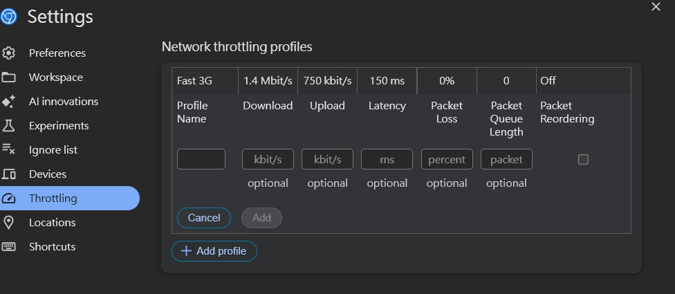
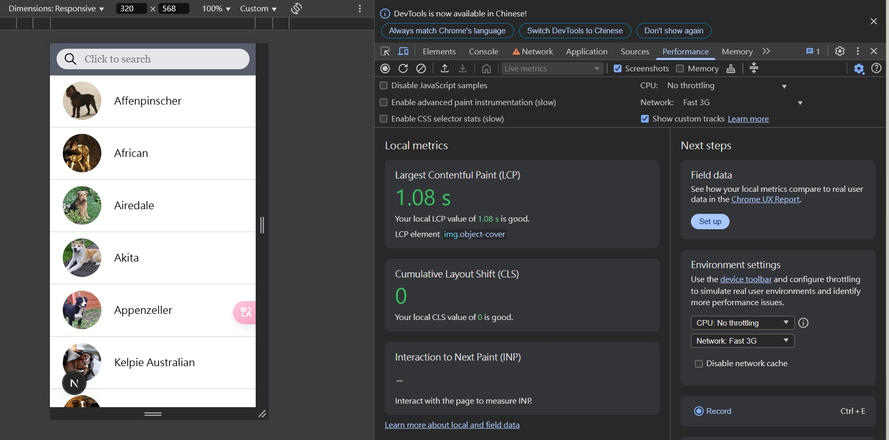
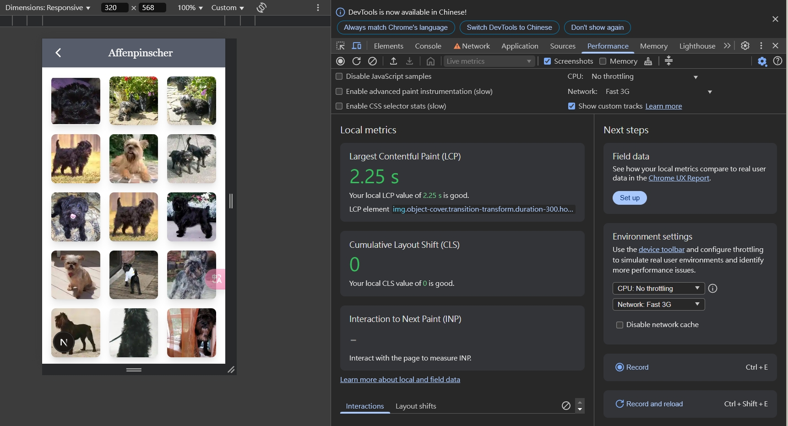
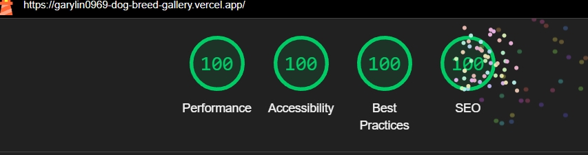
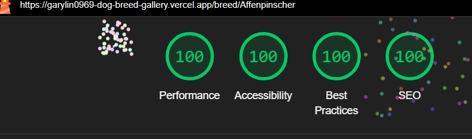

# Dog Breed Gallery 說明文件

[線上版本點我](https://garylin0969-dog-breed-gallery.vercel.app/)

[GitHub repo](https://github.com/garylin0969/dog-breed-gallery)

## 一、本地運行

### 環境需求

-   Node.js 18.0.0 或更高版本
-   pnpm、npm 或 yarn

### 安裝步驟

1. 安裝：

    ```bash
    pnpm install
    ```

2. 運行：

    ```bash
    pnpm dev
    ```

    開發伺服器將在 http://localhost:3000 啟動

3. 建置生產版本：

    ```bash
    pnpm build
    ```

4. 運行生產版本：
    ```bash
    pnpm start
    ```
    生產伺服器將在 http://localhost:3000 啟動

## 二、技術選擇說明

### 核心框架與工具

-   **框架**：[Next.js 15](https://nextjs.org/) 搭配 App Router
-   **語言**：[TypeScript](https://www.typescriptlang.org/)
-   **樣式**：[Tailwind CSS 4](https://tailwindcss.com/)
-   **API**：[Dog CEO API](https://dog.ceo/dog-api/)
-   **部署**：[Vercel](https://vercel.com/)

### 架構設計

-   **原子設計**：採用原子設計模式（Atomic Design），分為 atoms、molecules 和 organisms 三層
-   **服務層**：將 API 邏輯封裝在 services 目錄中

### 延伸功能

-   樣式顏色調整
-   RWD
-   右下 Scroll To Top Button
-   圖片牆照片陰影
-   輪播牆下方顯示 當前張/共幾張
-   Loading 以提升用戶體驗
-   NotFound、GlobalError

### 專案結構

```
dog-breed-gallery/
├── public/             # 靜態資源
├── src/
│   ├── app/            # Next.js App Router 頁面
│   ├── components/     # UI 元件（ 按Atomic Design ）
│   │   ├── atoms/      # 基本組成
│   │   ├── molecules/  # 原子的組合
│   │   └── organisms/  # 複雜 UI 區塊
│   ├── lib/            # 工具
│   └── services/       # API
│       └── dog-apis.ts # Dog API 整合
└── ...其他
```

## 三、前端可以優化或改進的地方

-   列表資料分批載入
    -   前 N 筆使用 server 載入，後續可選擇在 client 實現 Lazy Loading
    -   名稱與照片分開索取
-   將搜尋改為即時搜尋
-   輪播牆改為點擊背景遮罩即可關閉，不需要按 X

## 四、測試

### Google Chrome 現行預設 3G 為 Slow 3G

Google Chrome DevTools Fast 3G 設定：

```
Settings -> Throttling -> Add profile
```

| Profile Name | Download | Upload | Latency |
| ------------ | -------- | ------ | ------- |
| Fast 3G      | 1440     | 750    | 150     |



### 本地運行測試

-   狗狗列表首頁 http://localhost:3000



-   狗狗圖片牆 http://localhost:3000/Affenpinscher ( 列表第一筆 )



### 線上版本 Light House

-   狗狗列表首頁 https://garylin0969-dog-breed-gallery.vercel.app/



-   狗狗圖片牆 https://garylin0969-dog-breed-gallery.vercel.app/breed/Affenpinscher ( 列表第一筆 )


